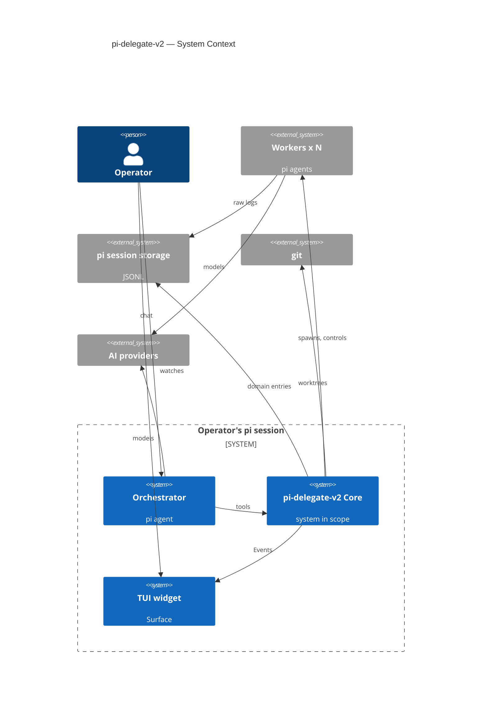

# pi-delegate-v2 — C4 Context

Level 1 of the C4 model: the system in scope, the people, and the
external dependencies. Domain language: `v2/CONTEXT.md`. Everything here
traces to the approved `v2/ARCHITECTURE.md` — this document adds no new
decisions.

Approved by the Stakeholder, 2026-10-06.

## Elements

- **Person — Operator**: the human in the pi session; describes tasks,
  answers Questions, issues Controls, verifies acceptance.
- **Software system (in scope) — pi-delegate-v2 Core**: the domain +
  orchestration engine (a pi extension); UI-blind; enforces the Brief /
  Budget / Report contracts; emits Events.
- **Software actor — Orchestrator**: the pi agent in the Operator's pi
  session; plans work, writes Briefs, drives the Core through its four
  tools, verifies Reports. Named role of an agent, not a separate product.
- **External system — pi harness**: agent runtime, TUI, session JSONL
  storage; hosts the Core, the Orchestrator and the headless Worker
  sessions; writes the session logs.
- **External system — git**: repositories; source of Worktrees (Worktree
  checkout mode).
- **External system — AI model providers**: serve model calls for the
  Orchestrator and Workers (via pi).

## Diagram

**Line semantics:** solid = control and commands · dashed = data and
observation · dotted = model calls · bold = the main orchestration axis
(Core → Workers).

## Relations (precise labels — kept out of the diagram on purpose)

| From → To | Meaning |
|---|---|
| Operator → Orchestrator | chat: tasks, Questions, Controls |
| Operator → TUI widget | watches the Fleet |
| Orchestrator → Core | `fleet_spawn` · `fleet_control` · `fleet_answer` · `fleet_status` |
| Core → TUI widget | live Events |
| Core → Workers | spawns, controls (headless child processes) |
| Core → pi session storage | custom entries (v2 domain events) |
| Workers → pi session storage | raw activity, logged by pi (JSONL) |
| Core → git | creates and owns Worker worktrees |
| Workers → AI providers | model calls via pi |
| Orchestrator → AI providers | model calls via pi |

## Notes

- C4 mapping choices: the Orchestrator and the TUI widget are shown as
  systems inside the `Operator's pi session` boundary — the Core is the
  system in scope; the Orchestrator is a named role of a pi agent, the
  widget is the Core's only Surface in this release.
- The TUI widget is the only Surface in the Core release; a web UI would
  be an equal consumer of the same Events (later Brief).
- Workers live in their own pi sessions; a Fleet spans N+1 sessions.
- The Core never writes a parallel log: Streams are pi's session JSONL,
  enriched with v2 custom entries.
